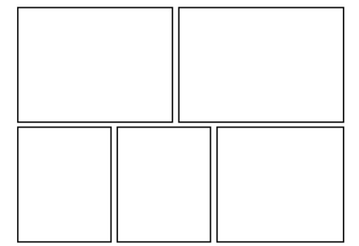

## **À l'aide une petite bande dessinée, vous montrerez comment et pourquoi ce personnage est tout entortillé...**

## **🔎 Modalité**

1h30 de pratique 4 cases minimum (qui peuvent etre tracées à main levée et prendre la forme que vous souhaitez)

**Voici un exemple de cases de bande dessinée**

## **🟢 Auto-évaluation        TBM MS MF MI**

1. **On comprend facilement la raison pour laquelle le personnage est entortillé** *Adapter son projet en fonction des contraintes de réalisation et de la prise en compte du spectateur*
2. **J'ai été calme et impliqué** *Compétence transvérsale: Vivre ensemble*

## 👩🏼‍🏫 On apprend quoi?

**Rythme, mouvement, raconter avec des images fixes, narration visuelle**

## **📚 Point de programme**

> **La narration visuelle** 
>
> les compositions plastiques, en deux et en trois dimensions, à des fins de récit ou de témoignage, l’organisation des images fixes et animées pour raconter